<div align="center">

# PRAHARI · प्रहरी

### Privacy-preserving Real-time Acoustic Hybrid Activation for Resource-constrained IoT

**A Hindi wake word that runs entirely on a low-cost microcontroller, decides on the chip,<br>and hands your speech to the cloud over a link that is already open.**


**Team DRAMAS** · Problem Statement **26172** — *Low Latency and Efficient Voice Activator for Edge Devices* (ISRO / Department of Space)

</div>

---

## Contents

1. [At a glance](#at-a-glance)
2. [The problem and how PRAHARI meets it](#the-problem-and-how-prahari-meets-it)
3. [How it works](#how-it-works)
4. [Key features](#key-features)
5. [Repository layout](#repository-layout)
6. [Hardware](#hardware)
7. [Quick start — run the demo](#quick-start--run-the-demo)
8. [Serial console commands](#serial-console-commands)
9. [Cloud mode (AWS)](#cloud-mode-aws)
10. [The model](#the-model)
11. [Training pipeline](#training-pipeline)
12. [Evaluation and benchmarks](#evaluation-and-benchmarks)
13. [Measured results](#measured-results)
14. [Host-side tests](#host-side-tests)
15. [Troubleshooting](#troubleshooting)
16. [Roadmap](#roadmap)
17. [References](#references)
18. [Team](#team)
19. [License](#license)

---

## At a glance

| | Measured on a Seeed XIAO ESP32-S3 Sense |
|---|---|
| **Keyword** | प्रहरी (*prahari*, "sentinel") — custom, trained from scratch |
| **Model** | 20.7 KB int8 depthwise-separable CNN, 17 operators |
| **Decision time** | **27.2 ms** per inference, fully on-chip |
| **Idle CPU** | **7.8 %** (limit 10 %) — 125 s of silence, gate opened 0 times |
| **Peak RAM** | **≤ 195 KB of 256 KB** (76 %) while streaming |
| **Keyword → link ready** | **1 ms** (connection already open) |
| **Keyword → server ACK** | **50 ms** median round trip to AWS Mumbai over 4G · 43.5 ms on LAN |
| **False wakes** | **0.48 / hour** on 6.26 h of held-out real audio · 0 of 16 real-use false wakes |
| **Real speakers** | **96.4 %** detected (female 94.2 %, male 98.6 %) · 0 / 40 sound-alikes accepted |
| **Uplink** | IMA-ADPCM 4:1 → 64 kbps, 1.5 s pre-roll, VAD end-pointing |
| **Stack** | 100 % open source — no proprietary voice SDK anywhere |

---

## The problem and how PRAHARI meets it

| PS 26172 requirement | PRAHARI | Status |
|---|---|:---:|
| Custom keyword, not a generic assistant wake word | प्रहरी, trained from scratch on our own data | ✅ |
| Open-source frameworks only | TensorFlow Lite Micro, ESP-NN, TensorFlow, Vosk | ✅ |
| RAM under 256 KB | ≤ 195 KB peak, PSRAM not used | ✅ |
| Idle-listening CPU under 10 % | 7.8 % measured | ✅ |
| High true-positive, near-zero false activations | 96.4 % real-speaker detection · 0.48 false wakes / h | ✅ |
| Low latency, keyword end → cloud ASR | link ready in 1 ms · 50 ms round trip to AWS | ✅ |
| Evaluated on a physical low-power MCU | every device number read from the XIAO ESP32-S3 | ✅ |

---

## How it works

```mermaid
flowchart LR
    subgraph EDGE["On the chip — always on"]
        MIC["PDM mic<br/>16 kHz"] --> FE["Log-mel front-end (C)<br/>0.49 ms / 10 ms hop"]
        FE --> GATE["Energy gate<br/>scan 960 ms idle / 120 ms"]
        GATE --> CNN["DS-CNN int8<br/>20.7 KB · 27.2 ms"]
        CNN --> BURST["Burst scan<br/>peak-of-2 · refractory"]
        BURST --> TRIG(["TRIGGER"])
    end
    subgraph UP["After the keyword"]
        TRIG --> PRE["1.5 s ADPCM<br/>pre-roll ring"]
        PRE --> VAD["VAD<br/>end-pointing"]
        VAD --> LINK["Warm TCP link<br/>open since boot"]
    end
    subgraph CLOUD["Server / cloud"]
        LINK --> ASR["Vosk ASR<br/>(Hindi)"]
        ASR --> DASH["Live dashboard"]
    end
```



1. **Listen.** The on-board PDM microphone is read at 16 kHz. A C front-end turns every 10 ms hop into one row of 40 log-mel features (real-input FFT, ring buffer, `-O3`) — 0.49 ms of work per hop.
2. **Sleep while listening.** An energy gate with a filtered noise floor decides whether there is sound at all. In silence the network runs once every 960 ms; when there is sound, every 120 ms.
3. **Decide on the chip.** A 20.7 KB int8 depthwise-separable CNN scores the last ~1 s of audio in 27.2 ms on ESP-NN kernels. A near-miss (score ≥ 0.50) arms 40 ms **burst scans** for half a second so a short score peak is never stepped over. **Peak-of-2** confirmation and a 1.5 s refractory period give one trigger per spoken keyword.
4. **Stream instantly.** The TCP link to the server is opened at boot and kept alive with ping/pong. On the keyword the last **1.5 s** of audio — already IMA-ADPCM compressed in a 12.2 KB ring — goes out first, then live audio until on-device **VAD** detects the end of speech. A privacy LED is lit only while audio is leaving the device.
5. **Transcribe.** The server decodes ADPCM, runs **Vosk** (offline, open-source Hindi ASR) and pushes the transcript to a live web dashboard.

---

## Key features

| | Feature | What it does | Proof |
|---|---|---|---|
| 🧠 | **On-chip wake word** | int8 neural network decides on the MCU; works with no network at all | 20.7 KB · 27.2 ms |
| 🔒 | **Privacy by design** | no audio leaves before प्रहरी; privacy LED while streaming; server can run on-premise | 0 bytes before the keyword |
| ⚡ | **Link already open** | connection made at boot, never a handshake after the keyword | 1 ms ready · 50 ms RTT to AWS |
| ⏪ | **Zero-clip pre-roll** | last 1.5 s of audio kept compressed in RAM, so no syllable is cut | 1.5 s in 12.2 KB |
| 🌙 | **Sleeps while it listens** | energy gate + dual-rate scan | 7.8 % idle CPU |
| 🔍 | **Burst scanning** | zooms in with 40 ms scans when a sound looks like the keyword | +9.7 pts detection for +0.4 % CPU |
| 🚫 | **Rejects look-alike words** | separates प्रहरी from प्रहर, पहरी, प्रहार — one ~100 ms vowel apart | 0 / 40 real sound-alikes |
| 🛡️ | **Near-zero false wakes** | trained against 605 h of real Indian speech, TV, music and noise | 0.48 / h |
| ⏹️ | **Knows when you stop** | on-device VAD closes the stream | ends ~0.8 s after speech |
| 📦 | **4× less bandwidth** | IMA-ADPCM 4:1 | 64 kbps · 24.8 dB SNR |
| 🔄 | **Self-healing link** | keep-alive, background reconnect, LAN auto-discovery; the mic never pauses in a network stall | rode out a 1.2 s 4G stall |
| 🧪 | **Self-test & field tuning** | model checked bit-exact against the laptop at every boot; threshold and gain tunable over serial | no reflash to re-tune |

---

## Repository layout

```
144853_DRAMAS_SIH_2026/
├── platformio.ini            PlatformIO project (ESP-IDF 4.4 + Arduino as a component)
├── CMakeLists.txt            ESP-IDF root project (ESP-NN switch lives here)
├── sdkconfig.defaults        tuned ESP-IDF config (WiFi/LWIP buffers, 8 MB flash)
├── partitions.csv            4 MB factory partition
├── dependencies.lock
│
├── src/
│   ├── main.cpp              firmware: mic, gate, inference, burst scan, trigger, uplink, serial console
│   └── CMakeLists.txt        app component (-O3 scoped to our code)
│
├── firmware/
│   ├── core/                 portable C shared by the board and host tests
│   │   ├── prahari_logmel.*  log-mel front-end (real-input FFT, sparse mel tables)
│   │   ├── prahari_link.*    warm uplink: framing, ping/pong, ADPCM blocks, reconnect
│   │   ├── prahari_config.h  frozen feature contract (16 kHz, 40 mels, 98 frames)
│   │   ├── prahari_tables.h  generated mel / window tables
│   │   ├── prahari_model.h   the int8 model as a C array (generated)
│   │   └── prahari_test_clip.h  boot self-test clips + expected scores (generated)
│   ├── hal/
│   └── test/                 host tests: front-end diff, link soak test, stall proxy
│
├── server/
│   ├── server.py             TCP receiver + Vosk ASR + dashboard + UDP discovery
│   ├── prahari_recv.py       dependency-free receiver for cloud latency tests
│   ├── ima_adpcm.py          ADPCM decoder
│   └── static/index.html     live dashboard
│
├── training/                 data → features → model → int8 → firmware header
│   ├── retrain.py            the whole pipeline in one command
│   ├── prep_corpus.py        hundreds of hours of audio → float16 feature shards
│   ├── train_stream.py       streamed training with evaluation inside the loop
│   ├── export_tflite.py      int8 export + arena measurement + C header
│   ├── fa_eval.py            false wakes per hour on held-out audio
│   ├── eval_human.py         real-speaker detection, per speaker / gender
│   ├── artifacts/            the shipped model (+ ship_0918 baseline)
│   └── …                     model, augmentation, front-end reference, experiments
│
├── tools/                    data generation, recording, benchmarking
│   ├── bench_log.py          serial log → latency / RAM / CPU / capture report (JSON)
│   ├── record_prahari.py     guided recording tool for test speakers
│   ├── net_rtt.py            laptop → server TCP baseline
│   ├── setup_components.sh   fetch + patch esp-tflite-micro and esp-nn
│   └── …                     corpus download and voice generation
│
├── logs/                     board logs behind the published numbers
└── docs/
    └── PRAHARI_SIH2026_DRAMAS.pdf   idea submission deck
```

---

## Hardware

| Part | Notes |
|---|---|
| **Seeed Studio XIAO ESP32-S3 Sense** | 240 MHz dual-core Xtensa LX7, on-board PDM MEMS mic, 8 MB flash. PSRAM is **not** used — everything fits in the 256 KB budget. |
| Privacy LED | GPIO 21 (`PRIVACY_LED_PIN` in `src/main.cpp`) |
| Laptop / server | any machine that can run Python 3.10+ and Vosk |
| Network | any 2.4 GHz WiFi or a phone hotspot |

Any ESP32-S3 board with a PDM or I2S microphone works after changing the pin defines at the top of `src/main.cpp`.

---

## Quick start — run the demo

### 1. Server (laptop)

```bash
cd server
pip install -r requirements.txt
```

Download the Hindi Vosk model **vosk-model-small-hi-0.22** from <https://alphacephei.com/vosk/models> and unzip it inside `server/` (the server finds any `vosk-model*` folder automatically).

```bash
python server.py
```

| Port | Purpose |
|---|---|
| TCP 5005 | device uplink (one warm connection per device) |
| UDP 5006 | auto-discovery — the board finds the laptop by itself |
| HTTP 8000 | dashboard → open <http://localhost:8000> |

Every utterance is also saved to `server/captures/` as a `.wav`.

### 2. Firmware (ESP32-S3)

**Prerequisites:** [PlatformIO](https://platformio.org/) (VS Code extension or CLI) and Git Bash on Windows.

```bash
# one time: fetch and patch the TensorFlow Lite Micro + ESP-NN components
bash tools/setup_components.sh
```

> Tested with **esp-tflite-micro 1.4.0** and **esp-nn 1.3.2** on **ESP-IDF 4.4.7**.

Set your WiFi in `src/main.cpp`:

```cpp
#define WIFI_SSID     "YOUR_WIFI_SSID"
#define WIFI_PASS     "YOUR_WIFI_PASSWORD"
#define PRAHARI_SERVER_MODE 0      // 0 = laptop on the same network, 1 = cloud
```

Build, flash and open the serial monitor:

```bash
pio run -e xiao_esp32s3 -t upload
pio device monitor -e xiao_esp32s3 -f esp32_exception_decoder -f log2file
```

On boot the board runs its **self-test** (the model must reproduce the laptop's int8 scores), connects to WiFi, discovers the server and prints `link: UP`.

### 3. Say प्रहरी

Say **प्रहरी** (*pra-ha-REE*) followed by a command. The serial monitor prints the score and latency, the privacy LED lights while audio streams, and the transcript appears on the dashboard.

---

## Serial console commands

| Command | Action |
|---|---|
| `t0.85` | set the trigger threshold |
| `g2.0` | set microphone gain |
| `b` / `b0.40` | burst scanning on/off / set its arming score |
| `r` | reset the hit counter and CPU average |
| `q` | quiet test — reports gate opens and idle CPU |
| `l` | warm-link report (state, reconnects, pings) |
| `s` | record and send a few seconds without the keyword |
| `n` | record and send 60 s of room audio |
| `c60` | capture ceiling in seconds |
| `v` | VAD trace on/off |
| `p20` | per-operator timing over 20 inferences |
| `?` | help |

---

## Cloud mode (AWS)

1. Launch a small Linux instance (we used **EC2 ap-south-1, Mumbai**) and allow **inbound TCP 5005** in its security group.
2. Copy `server/prahari_recv.py` and `server/ima_adpcm.py` to it and run:
   ```bash
   python3 prahari_recv.py
   ```
   It prints every wake event and a running **median / p90** of the device-measured round trip.
3. In `src/main.cpp` set `PRAHARI_SERVER_MODE 1` and `SERVER_IP` to the instance's public IP, then rebuild and flash.
4. Optional baseline from the laptop on the same network:
   ```bash
   python tools/net_rtt.py <server-ip> 5005 20
   ```

---

## The model

```
input 98 × 40 log-mel (≈ 1 s, 10 ms hop, int8)
  Conv2D 8 ch, kernel 2×16, stride (1,2)        input BatchNorm folded in
  MaxPool (2,1)
  DS block 16 ch   ─ depthwise 5×3 → BN → ReLU → pointwise 1×1 → BN → ReLU
  MaxPool (2,2)
  DS block 32 ch
  MaxPool (2,2)
  DS block 32 ch (residual) × 2
  AveragePool 12×5 → Conv 1×1 → sigmoid
```

| | |
|---|---|
| Size | **20.7 KB** int8 flatbuffer, 17 operators |
| Tensor arena | 36 KB (static) |
| Inference | **27.2 ms** on ESP32-S3 with ESP-NN (15.6× faster than reference kernels) |
| Front-end | 40 log-mel bins, 30 ms window, 10 ms hop — the C and Python front-ends agree on **all 94,080** int8 test values |

**How we got from 105.6 ms to 27.2 ms** — six architectures, each profiled operator by operator on the chip:

| Version | Change | Inference |
|---|---|---:|
| v4 | full-time-resolution stem, (5,3) kernels | 105.6 ms |
| v5 | channel widths 8/16/32 (ESP-NN fast paths) | 64.3 ms |
| v8-C | pooling before the tail blocks | 46.3 ms |
| v9 | stem kernel 2×16, BatchNorm fold, MEAN → AvgPool | **27.2 ms** |

The architecture sweeps are in `training/model_v8.py`, `train_v8.py`, `train_v9.py` and `probe_stem.py`; the rejected two-stage cascade gate is in `gate_model.py` / `train_gate.py`.

---

## Training pipeline

### Data

| Side | Sources |
|---|---|
| **Not the keyword** — 2.18 M one-second windows (≈ 605 h) | AI4Bharat IndicVoices, Kathbath, Shrutilipi · OpenSLR 104 (Hindi-English) · Common Voice Hindi · MUSAN · FSD50K · ESC-50 · the board's own room noise |
| **Keyword** — 182 synthetic voice variants in 9 Indian languages | Microsoft neural voices (edge-tts), AI4Bharat IndicF5, ElevenLabs. Every voice also says sound-alikes and sentences as negatives, so "synthetic voice" is never a cue for the keyword. |

Real human recordings are used **only for evaluation**, never for training.

Augmentation: background noise and crowd babble, reverb (RT60 ≤ 0.35 s — more erases the final vowel that separates प्रहरी from प्रहर), gain −20 / +6 dB, spectral tilt, pitch shift, speed, word-length stretch, clipping.

### Environment

```bash
pip install -r training/requirements.txt
```

### Steps

```bash
# 1. download the large corpora (resumable)
python tools/download_data.py --root E:\PRAHARI_DATA

# 2. keyword voices
python tools/gen_voices.py edge          # Microsoft neural voices
python tools/gen_indicf5.py              # IndicF5 (GPU)
python tools/gen_tts_dataset.py          # ElevenLabs (needs tools/elevenlabs_keys.txt)

# 3. local negatives
python tools/build_negatives.py
python tools/prep_common_voice.py
python tools/prep_cv_full.py
python tools/prep_esc_events.py

# 4. everything else in one command (set PRAHARI_DATA if your data is not in E:\PRAHARI_DATA):
#    val/test sets → feature shards → training → int8 export → self-test clips → evaluation
cd training
python retrain.py

# 5. put the new model on the board (copies headers + threshold into the firmware)
python retrain.py --install artifacts/<run-folder>
```

`train_stream.py` evaluates **inside the training loop**: every epoch is scored on held-out continuous audio (false wakes per hour) and on real speakers using the firmware's own scan schedule, and the epoch kept is the one that detects the most keywords at ≤ 0.5 false wakes per hour.

---

## Evaluation and benchmarks

| Script | What it measures |
|---|---|
| `tools/bench_log.py [log]` | turns a saved serial log into the numbers: server ACK median/p90, link-ready time, captures, RAM peak, front-end/inference time, idle CPU → optional `--json` |
| `training/fa_eval.py [model]` | false wakes per hour on held-out continuous audio, peak-of-2 and 2-in-a-row, several thresholds |
| `training/eval_human.py [model-folder]` | real-speaker detection per speaker, gender and condition |
| `training/validate_c_frontend.py` | C front-end vs Python reference |
| `training/arena_calc.py model.tflite` | predicts the TFLM tensor arena before flashing |
| `tools/record_prahari.py` | guided 10-minute recording session for new test speakers (keyword at several distances, soft, fast, noisy, sound-alikes, sentences, free talk) |
| `tools/static_ram.py` | static DRAM read from `firmware.elf` |

The logs behind the published numbers are in `logs/`:

```bash
python tools/bench_log.py logs/device-monitor-260923-225844.log     # latency + captures
python tools/bench_log.py logs/device-monitor-260923-234711.log     # idle CPU
```

---

## Measured results

### Efficiency

| Metric | Value |
|---|---|
| Idle CPU (125 s silence) | **7.8 %** — front-end 5 %, network 2.8 % |
| Peak internal RAM | **189.9 KB** on LAN · **195.2 KB** streaming to AWS (of 256 KB) |
| Model / arena | 20.7 KB flash / 36 KB RAM |
| Front-end | 1.76 → **0.49 ms** per hop (real FFT, `-O3`, ring buffer) |

### Latency

| Path | Result |
|---|---|
| Keyword → link ready | **1 ms** (warm) — a cold TLS handshake on this board measured 1,210 ms |
| Keyword → server ACK, LAN hotspot | **43.5 ms** median, p90 68 ms (n = 10) |
| Keyword → server ACK, AWS Mumbai over 4G | **50 ms** median (n = 9); device side ≤ 4 ms every time |
| Captures | 10 / 10 clean, 0 ms dropped, 10 / 10 end-pointed on silence |

### Accuracy

| Test | Result |
|---|---|
| False wakes, 6.26 h held-out audio, threshold 0.90 | **0.48 / h** (first model: 36.4 / h → 75× fewer) |
| Real false wakes collected on the board | **0 / 16** still fire |
| Real speakers, fresh recordings, board-style scanning, threshold 0.85 | **96.4 %** — female 94.2 %, male 98.6 % |
| Same, threshold 0.70 | 99.3 % |
| Real sound-alike words (प्रहर, पहरी, प्रहार …) | **0 / 40** accepted |
| Held-out synthetic voices | **100 %** of 340 keywords · 0 / 177 sound-alikes |

---

## Host-side tests

```bash
# front-end: C vs Python on the same audio
gcc -O2 -Ifirmware/core firmware/test/test_logmel.c firmware/core/prahari_logmel.c -lm -o firmware/test/test_logmel
cd training && python validate_c_frontend.py && cd ..

# uplink soak test against a local receiver, and a proof that every block arrived in order
gcc -O2 -Ifirmware/core -DPL_TEST_SNDBUF=2880 firmware/test/test_link.c firmware/core/prahari_link.c -lm -o test_link
python server/prahari_recv.py &
./test_link 127.0.0.1 5005 5 60 2 3
python firmware/test/check_wav.py server/captures/*.wav

# WiFi-stall simulation: freeze the uplink for 2 s right after a wake header
python firmware/test/stall_proxy.py 5010 5005 2     # then point test_link at port 5010
```

---

## Troubleshooting

| Symptom | Fix |
|---|---|
| `discovery: no answer` | laptop and board must be on the same network; allow Python through Windows Firewall |
| `connect FAILED` in cloud mode | the security group is not allowing inbound TCP 5005 |
| Build cannot find `esp_nn.h` | run `tools/setup_components.sh`, then touch the root `CMakeLists.txt` |
| sdkconfig changes have no effect | delete the generated `sdkconfig.xiao_esp32s3` — ESP-IDF only reads `sdkconfig.defaults` when it creates a fresh one |
| Serial monitor goes silent after reset | the XIAO's USB port is created by the firmware; reopen the monitor |
| `core_dir = C:/pio` | a Windows path in `platformio.ini`; remove that line on Linux / macOS |
| Dashboard shows no transcript | the Vosk model folder is missing from `server/` |

---

## Roadmap

- TLS on the warm link, within the RAM budget
- Power profiling with an INA226, then frequency scaling at idle
- Consented real-speaker keyword corpus at scale
- Streaming inference for active listening
- Long field logs in labs, crowds and machinery halls

---

## References

**Keyword spotting**
- Zhang et al., *Hello Edge: Keyword Spotting on Microcontrollers*, 2017 — [arXiv:1711.07128](https://arxiv.org/abs/1711.07128)
- Choi et al., *Temporal Convolution for Real-Time Keyword Spotting*, 2019 — [arXiv:1904.03814](https://arxiv.org/abs/1904.03814)
- Rybakov et al., *Streaming Keyword Spotting on Mobile Devices*, 2020 — [arXiv:2005.06720](https://arxiv.org/abs/2005.06720)
- Kim et al., *Broadcasted Residual Learning for Efficient KWS*, 2021 — [arXiv:2106.04140](https://arxiv.org/abs/2106.04140)
- Banbury et al., *MLPerf Tiny Benchmark*, 2021 — [arXiv:2106.07597](https://arxiv.org/abs/2106.07597)
- Park et al., *SpecAugment*, 2019 — [arXiv:1904.08779](https://arxiv.org/abs/1904.08779)

**On-device stack**
- David et al., *TensorFlow Lite Micro*, MLSys 2021 — [arXiv:2010.08678](https://arxiv.org/abs/2010.08678)
- Espressif ESP-NN — <https://github.com/espressif/esp-nn>
- openWakeWord (the < 0.5 false accepts / hour bar) — <https://github.com/dscripka/openWakeWord>
- microWakeWord on ESP32-S3 — <https://www.home-assistant.io/blog/2024/02/21/voice-chapter-6/>
- Vosk speech recognition — <https://alphacephei.com/vosk>

**Datasets and voices**
- IndicVoices — [arXiv:2403.01926](https://arxiv.org/abs/2403.01926) · Kathbath / IndicSUPERB — [arXiv:2208.11761](https://arxiv.org/abs/2208.11761) · Shrutilipi — [arXiv:2208.12666](https://arxiv.org/abs/2208.12666)
- OpenSLR 104 — <https://openslr.org/104> · Common Voice — [arXiv:1912.06670](https://arxiv.org/abs/1912.06670) · MUSAN — [arXiv:1510.08484](https://arxiv.org/abs/1510.08484)
- FSD50K — [arXiv:2010.00475](https://arxiv.org/abs/2010.00475) · ESC-50 — <https://github.com/karolpiczak/ESC-50>
- IndicF5 — <https://github.com/AI4Bharat/IndicF5> · edge-tts — <https://github.com/rany2/edge-tts>

---

## Team

**Team DRAMAS** — Vivekananda Institute of Professional Studies – Technical Campus (VIPS-TC), New Delhi

| Member |
|---|
| Divyanshi |
| Rajani Kant Jha |
| Avani Sehgal |
| Mohisha |
| Agam Dayal |
| Aryaman Sharma |

---

## License

Released under the [MIT License](LICENSE). Third-party components (TensorFlow Lite Micro, ESP-NN, Vosk and the datasets above) keep their own licenses.
